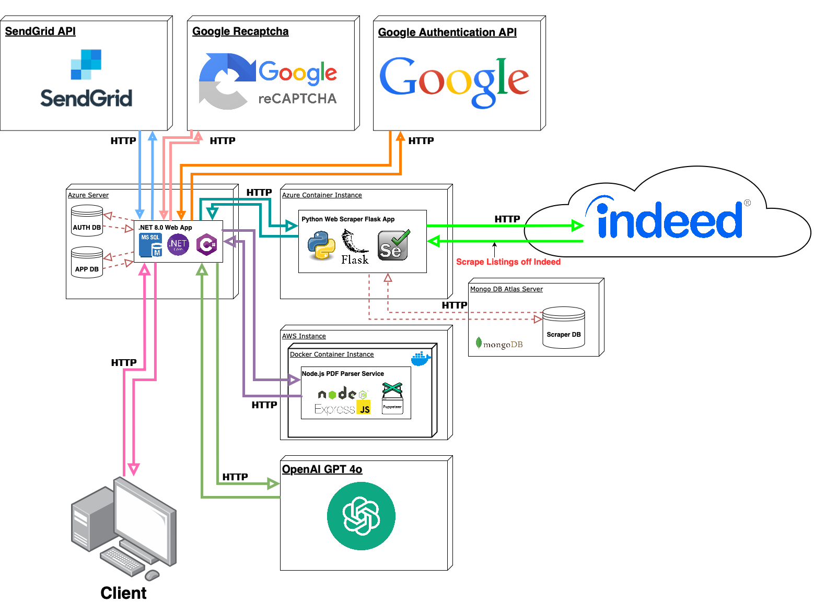

<h1 align="center">ResuMeta</h1>

Crafting a compelling resume in today's competitive job market can feel overwhelming. Enter ResuMeta: an intuitive platform designed to empower job seekers. ResuMeta simplifies the resume creation process by offering tools for enhancement and optimization. It tackles the frustration of being overlooked by resume-filtering software by ensuring every user's resume gets a fair chance.

## About
This software application is a Senior Capstone Project developed from the CharpSpark team at Western Oregon University in the 2024 graduating year. To learn more about the creators of ResuMeta, navigate to the [**Authors**](#authors) section

## Architecture

## Features
- Resumes:
    - Creation
    - Modification
    - Enhancement
    - Import / Export
- Cover Letters:
    - Creation
    - Modification
    - Enhancement
    - Import / Export
- Job Listings:
    - Search
    - Apply
    - Tailor Resume / Cover Letter
    - Track Application
- Application Tracker:
    - Organize and Track Job Applications
- Profiles
    - Show off to the world you're state-of-the-art resume!!

## Authors
 
[**Danielle Campbell**](https://github.com/daniellecampbell688)

 
[**Andrew Esch**](https://github.com/Coder-Andrew)

 
[**Zoe Robb**](https://github.com/zoerobb)

 
[**Ryan Hanson**](https://github.com/RyanHanson-WRX)