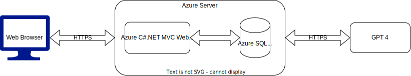

Project Inception Worksheet
=====================================

## Summary of Our Approach to Software Development
    What processes are we following?  How will we run this project? ==> Agile, Scrum, ...  
    What are we choosing to do, how will we do it and at what level of detail or extent?

## Vision Statement
    The AI-Powered Resume Enhancement Platform is a software application that enables stakeholders who already have a resume to submit their current resume, build a new resume based on recieved feedback from A.I. and industry-specific standards, as well as the capability to go back and edit their resume whenever they need to. For stakeholders who have no resume, this software application will elicit questions from the user in order to obtain enough information to build them a professional resume with ease. The purpose of this software is to enable end users the capability to produce a strong resume that will catch the attention of employers. CharpSpark is proposing this topic as each industry and position has different standards for what they look for in resumes, which can become a headache for people applying to jobs to figure out what they need to include in order to get their dream job. Not only do we recognize the difficulty to produce a strong resume, but A.I. and resume filtering softwares tend to leave applicants in the dark as to if their resume will even be looked at by human eyes. Through our proposed software, we would like to give applicants the upper hand in "defeating" these resume filtering techniques as we believe every applicant's resume should be given a chance at human review, not treated as merely another piece of data by software. <Any competitors?>

## Initial Vision Discussion with Stakeholders
    Summarize what was discussed.  What do they want? Include:

### Description of Clients/Users

### List of Stakeholders and their Positions (if applicable)
    Who are they? Why are they a stakeholder?

## Initial Requirements Elaboration and Elicitation
    See Requirements_template for more

### Elicitation Questions
    1. 
    2.
    3. ...

### Elicitation Interviews
    Transcript or summary of what was learned

### Other Elicitation Activities?
    As needed

## List of Needs and Features
    (Ability = User perspective | Process = Server side)
    1. Ability to submit resume
    2. Process to parse submitted resume
    3. Process to produce meaningful feedback on resume through A.I. & API technology
    4. Ability to review A.I. feedback
    5. Ability to build new resume based off of feedback
    6. Ability to save multiple resumes
    7. Ability to edit saved resumes
    8. Process to test resume against A.I. and resume filtering software programs
    9. Ability to test created or saved resumes
    11. Ability to generate a cover letter
    12. Ability to view and search for jobs through API
    13. Ability to enable alerts for job listings that match a user's criteria
    14. Ability to practice for interviews via industry-specific preparation questions

## Initial Modeling

### Use Case Diagrams
    Diagrams

### Sequence Diagrams

### Other Modeling
    Diagrams, UI wireframes, page flows, ...

## Identify Non-Functional Requirements
    1.
    2.
    3.

## Identify Functional Requirements (In User Story Format)

E: Epic  
U: User Story  
T: Task  

7. [E] 
    1. [U]
        a. [T]
        b. [T]
    2. [U]
        a. [T]

## Initial Architecture Envisioning

Diagrams and drawings, lists of components

## Agile Data Modeling
    Diagrams, SQL modeling (dbdiagram.io), UML diagrams

## Timeline and Release Plan
    Schedule: meaningful dates, milestones, sprint cadence, how releases are made (CI/CD, or fixed releases, or ?)