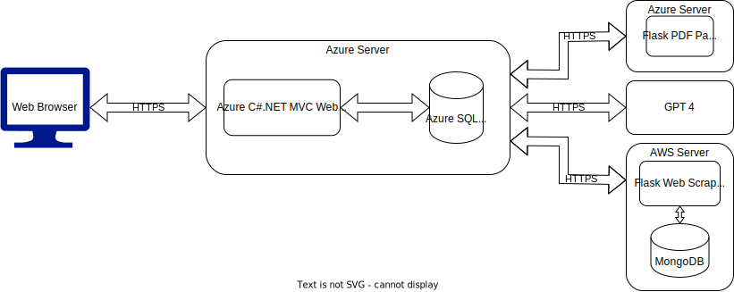

Project Inception Worksheet
=====================================

## Summary of Our Approach to Software Development
    What processes are we following?  How will we run this project? ==> Agile, Scrum, ...  
    What are we choosing to do, how will we do it and at what level of detail or extent?

## Vision Statement
The AI-Powered Resume Enhancement Platform is a software application that enables stakeholders who already have a resume to submit their current resume, build a new resume based on recieved feedback from A.I. and industry-specific standards, as well as the capability to go back and edit their resume whenever they need to. For stakeholders who have no resume, this software application will elicit questions from the user in order to obtain enough information to build them a professional resume with ease. The purpose of this software is to enable end users the capability to produce a strong resume that will catch the attention of employers. CharpSpark is proposing this topic as each industry and position has different standards for what they look for in resumes, which can become a headache for people applying to jobs to figure out what they need to include in order to get their dream job. Not only do we recognize the difficulty to produce a strong resume, but A.I. and resume filtering softwares tend to leave applicants in the dark as to if their resume will even be looked at by human eyes. Through our proposed software, we would like to give applicants the upper hand in "defeating" these resume filtering techniques as we believe every applicant's resume should be given a chance at human review, not treated as merely another piece of data by software. There are competitors and existing applications that do this, however, the largest difference is that ours is going to be free. Another thing to note is that we have thrown around a lot of ideas for features, and while all of those features have already been created by one company or another, we haven’t yet found a competitor that has all of the proposed features that we are listing.

## Description of Clients/Users

### List of Stakeholders and their Positions (if applicable)
- Employer => employers have the ability to get in touch with possible job candidates via posting their job listing or utilizing the 'Reverses Job Matching' feature on this application.

- Job Seeker => job seekers are a client of this application that are using this software to obtain their dream job.

- Student => students are a different type of client of this application, students may use this software in order to build a strong resume while also learning what it takes to stick out as a job applicant. Students may also utilize the interview preparation feature in order to practice for interviews.

- Developer => the developer's role in this project is to develop the software, working closely with all other stakeholders in order to create features catering to the stakeholders' needs.

- Advisors => the advisor stakeholder is closely related to the student stakeholder. Advisors/mentors/teachers would like to use this application in order to help teach their students about building resumes, cover letters, and the overall process of obtaining a job.

### User Personas
1. Emily Mitchell (Employer) 
    - **Age:** 41
    - **Hometown:** Portland, Oregon
    - **Job:** Emily is a successful entrepreneur and the founder of a tech startup focused on developing innovative solutions for sustainable energy.
    - **Background:** Emily earned her degree in Environmental Engineering from the University of Oregon and later pursued an MBA with a focus on Entrepreneurship. Her passion for the environment and sustainable practices has driven her to establish her own company, where she leads a team of dedicated professionals in creating impactful technologies. Emily is known for her forward-thinking approach and commitment to creating a positive environmental impact through her business ventures.

2. Adrian Reynolds (Job Seeker) 
    - **Age:** 23
    - **Hometown:** Austin, Texas
    - **Job:** Adrian is a recent graduate with a degree in Computer Science. He is actively seeking employment in the field of software development, with a particular interest in artificial intelligence and machine learning.
    - **Background:** Adrian excelled academically during his time at the University of Texas at Austin, where he participated in various coding competitions and interned at a local tech company. His passion for cutting-edge technologies and problem-solving has driven him to pursue a career in software development. Adrian is known for his strong analytical skills, adaptability, and his ability to work well in collaborative environments. He's actively building a portfolio showcasing his projects and coding skills to impress potential employers.

3. Jasmine Patel (Student) 
    - **Age:** 20
    - **Hometown:** Chicago, Illinois
    - **Job:** None, Jasmine is a junior majoring in Marketing at the University of Chicago.
    - **Background:** Born and raised in a culturally diverse community in Chicago, Jasmine has always been fascinated by the world of marketing and its impact on consumer behavior. She actively participates in student organizations related to marketing and business, where she has had the opportunity to work on various projects, gaining hands-on experience in creating marketing campaigns and conducting market research. Jasmine is known for her creativity, strong communication skills, and her ability to think strategically. She is also involved in community service initiatives, demonstrating her commitment to making a positive impact beyond the academic setting.

## Initial Requirements Elaboration and Elicitation
    See Requirements_template for more

### Elicitation Questions
    1. 
    2.
    3. ...

### Elicitation Interviews
    Transcript or summary of what was learned

### Other Elicitation Activities?
    As needed

## List of Needs and Features
    (Ability = User perspective | Process = Server side)
    1. Ability to submit resume
    2. Process to parse submitted resume
    3. Process to produce meaningful feedback on resume through A.I. & API technology
    4. Ability to review A.I. feedback
    5. Ability to build new resume based off of feedback
    6. Ability to save multiple resumes
    7. Ability to edit saved resumes
    8. Process to test resume against A.I. and resume filtering software programs
    9. Ability to test created or saved resumes
    11. Ability to generate a cover letter
    12. Ability to view and search for jobs through API
    13. Ability to enable alerts for job listings that match a user's criteria
    14. Ability to practice for interviews via industry-specific preparation questions

## Initial Modeling
- [MindMap](https://miro.com/app/board/uXjVN4G_02o=/)

### Use Case Diagrams
    Diagrams

### Sequence Diagrams

### Other Modeling
    Diagrams, UI wireframes, page flows, ...

## Identify Non-Functional Requirements
    1.
    2.
    3.

## Identify Functional Requirements (In User Story Format)

E: Epic  
U: User Story  
T: Task  

7. [E] 
    1. [U]
        a. [T]
        b. [T]
    2. [U]
        a. [T]

## Initial Architecture Envisioning

Diagrams and drawings, lists of components

## Agile Data Modeling
    Diagrams, SQL modeling (dbdiagram.io), UML diagrams

## Timeline and Release Plan
    Schedule: meaningful dates, milestones, sprint cadence, how releases are made (CI/CD, or fixed releases, or ?)