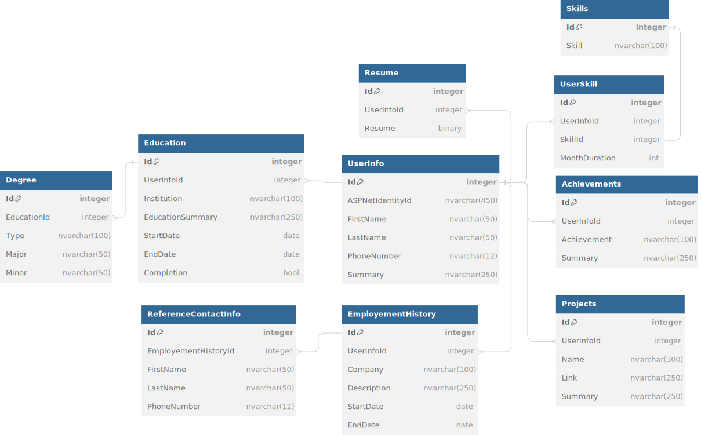

CharpSpark Inception Worksheet
=====================================

## Summary of Our Approach to Software Development
Agile, Scrum, Git Workflow, TDD, OOP, REST, microservice architecture

## Vision Statement
The AI-Powered Resume Enhancement Platform is a software application that enables stakeholders who already have a resume to submit their current resume, build a new resume based on recieved feedback from A.I. and industry-specific standards, as well as the capability to go back and edit their resume whenever they need to. For stakeholders who have no resume, this software application will elicit questions from the user in order to obtain enough information to build them a professional resume with ease. The purpose of this software is to enable end users the capability to produce a strong resume that will catch the attention of employers. CharpSpark is proposing this topic as each industry and position has different standards for what they look for in resumes, which can become a headache for people applying to jobs to figure out what they need to include in order to get their dream job. Not only do we recognize the difficulty to produce a strong resume, but A.I. and resume filtering softwares tend to leave applicants in the dark as to if their resume will even be looked at by human eyes. Through our proposed software, we would like to give applicants the upper hand in "defeating" these resume filtering techniques as we believe every applicant's resume should be given a chance at human review, not treated as merely another piece of data by software. There are competitors and existing applications that do this, however, the largest difference is that ours is going to be free. Another thing to note is that we have thrown around a lot of ideas for features, and while all of those features have already been created by one company or another, we haven’t yet found a competitor that has all of the proposed features that we are listing.

## Description of Clients/Users

### List of Stakeholders and their Positions (if applicable)
- Employer => employers have the ability to get in touch with possible job candidates via posting their job listing or utilizing the 'Reverses Job Matching' feature on this application.

- Job Seeker => job seekers are a client of this application that are using this software to obtain their dream job.

- Student => students are a different type of client of this application, students may use this software in order to build a strong resume while also learning what it takes to stick out as a job applicant. Students may also utilize the interview preparation feature in order to practice for interviews.

- Developer => the developer's role in this project is to develop the software, working closely with all other stakeholders in order to create features catering to the stakeholders' needs.

- Advisors => the advisor stakeholder is closely related to the student stakeholder. Advisors/mentors/teachers would like to use this application in order to help teach their students about building resumes, cover letters, and the overall process of obtaining a job.

### User Personas
1. Emily Mitchell (Employer) 
    - **Age:** 41
    - **Hometown:** Portland, Oregon
    - **Job:** Emily is a successful entrepreneur and the founder of a tech startup focused on developing innovative solutions for sustainable energy.
    - **Background:** Emily earned her degree in Environmental Engineering from the University of Oregon and later pursued an MBA with a focus on Entrepreneurship. Her passion for the environment and sustainable practices has driven her to establish her own company, where she leads a team of dedicated professionals in creating impactful technologies. Emily is known for her forward-thinking approach and commitment to creating a positive environmental impact through her business ventures.

2. Adrian Reynolds (Job Seeker) 
    - **Age:** 23
    - **Hometown:** Austin, Texas
    - **Job:** Adrian is a recent graduate with a degree in Computer Science. He is actively seeking employment in the field of software development, with a particular interest in artificial intelligence and machine learning.
    - **Background:** Adrian excelled academically during his time at the University of Texas at Austin, where he participated in various coding competitions and interned at a local tech company. His passion for cutting-edge technologies and problem-solving has driven him to pursue a career in software development. Adrian is known for his strong analytical skills, adaptability, and his ability to work well in collaborative environments. He's actively building a portfolio showcasing his projects and coding skills to impress potential employers.

3. Jasmine Patel (Student) 
    - **Age:** 20
    - **Hometown:** Chicago, Illinois
    - **Job:** None, Jasmine is a junior majoring in Marketing at the University of Chicago.
    - **Background:** Born and raised in a culturally diverse community in Chicago, Jasmine has always been fascinated by the world of marketing and its impact on consumer behavior. She actively participates in student organizations related to marketing and business, where she has had the opportunity to work on various projects, gaining hands-on experience in creating marketing campaigns and conducting market research. Jasmine is known for her creativity, strong communication skills, and her ability to think strategically. She is also involved in community service initiatives, demonstrating her commitment to making a positive impact beyond the academic setting.

## Initial Requirements Elaboration and Elicitation

### Elicitation Questions
1.
    - Q: Which epic will deliver the most amount of value to clients in the least amount of sprints? 
    - A: The "Build Resume" epic will deliver the most amount value to clients upon completion, because the user will immediately be able to perform actions with the software. This epic is also independent, while other epics/features will depend on this one to be complete.

2. 
    - Q: Should accessibility features be implemented as their own epic/feature, or should they be included as a task for each user story?
    - A: N/A, will be able to answer as project progresses as stakeholders clarify requirements.
3.
    - Q: Why was editing saved resumes important to our users?
    - A: It would be frustrating to our users if they can't go back and modify their previously created resumes.

4. 
    - Q: Why is having a user profile important?
    - A: Having a profile for users has value in that users need not to enter their basic information for each resume/cover letter they create. Profiles will also allow users to keep their scores for interview prep questions, as well as keeping track of job listings the user has applied to.

5. 
    - Q: How does A.I. feedback provide benefit to the user?
    - A: The A.I. will enable the user's resume to get passed A.I. and ATS resume filtering systems. It will also help the user's resume have a clean, strong, and professional look.

6. 
    - Q: What benefit does uploading a resume bring to the user?
    - A: Allowing the user to upload a resume they've previously created will reduce the amount of time the user would spend building/modifying the resume with the provided A.I. feedback. This will also give the user more time to focus on more important things, such as applying and getting their dream job.

## List of Needs and Features
    1. Build Resume (Save Resume)
    2. User Profile
    3. Edit Saved Resumes
    4. Resume feedback from A.I. (Dynamic Resume Sections, Integrated Soft Skills Assessment)
    5. Upload Resume (Parse Resume)
    6. Test Resume
    7. Create Cover Letter
    8. Job Listings (Web Scraper)
    9. Reverse Job Matching
    10. Job Application Tracker
    11. Automated Follow-up Reminders
    12. Personalized Job Market Reports
    13. AI Career Advisor
    14. AI Career Path Predictions
    15. Cross-Industry Skill Transferability Analysis
    16. Skill Gap Analysis
    17. Personal SWOT Analysis
    18. Interview Prep
    19. Automated LinkedIn Profile Sync
    20. Multilingual Support
    *** Accessibility Features (Should this be it's own epic, or are there smaller things we can accomplish with each sprint?)

## Initial Modeling
- [MindMap](https://miro.com/app/board/uXjVN4G_02o=/)

### Use Case Diagrams
    Diagrams

### Sequence Diagrams

### Other Modeling
- 
- [DB Diagram Link](https://dbdiagram.io/d/65b57b80ac844320aedb5a1f)
- 
- 
- 
- 
- 

## Identify Non-Functional Requirements
    1.
    2.
    3.

## Identify Functional Requirements (In User Story Format)

E: Epic  
U: User Story  
T: Task  

1. [E] Build Resume
    1. [U] As a user who has no previously created resume, I'd like to be able to fill out a form to create a resume.
        a. [T]
        b. [T]
    2. [U] As a user who has just created a resume, I'd like my resume to be saved so that I can modify it a later time.
        a. [T]
    3. [U] As a user who has multiple skills (along with other resume criteria), I'd like to be able to include all of them on my resume.
        a. [T]

2. [E] User Profile
    1. [U] As a user, I'd like to be able to make changes to my account and have it reflect in my saved work.
        a. [T]
    2. [U] As a user, I'd like a graphical dashboard where I can view all of my previously saved resumes.
        a. [T]

## Initial Architecture Envisioning

Diagrams and drawings, lists of components

## Agile Data Modeling
    Diagrams, SQL modeling (dbdiagram.io), UML diagrams

## Timeline and Release Plan
[Timeline](Resources/timeline.html)